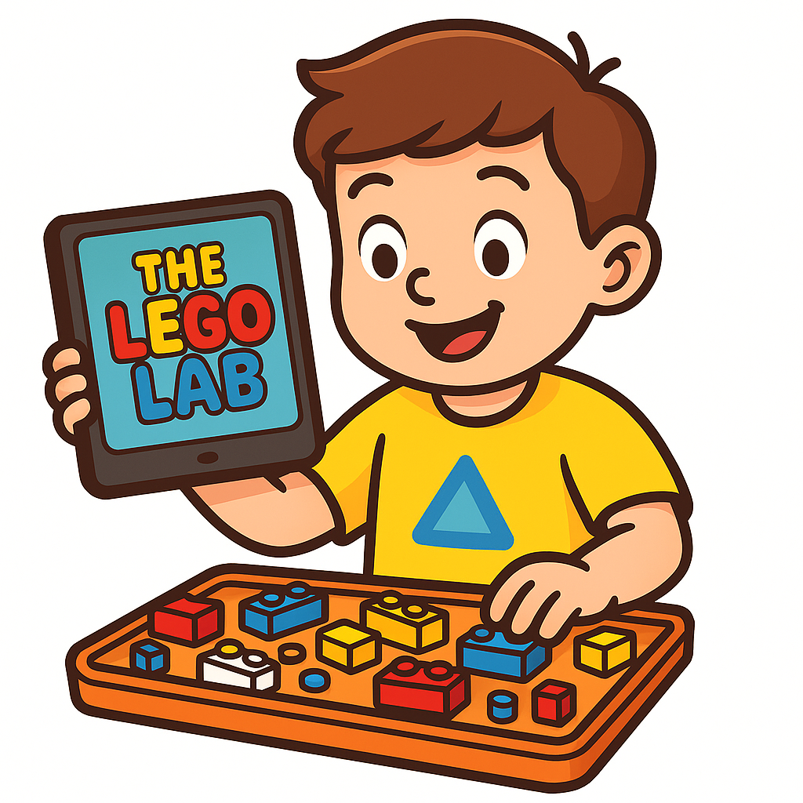

# The Lego Lab

A fun and creative web app for kids aged 4–12 to turn ideas into LEGO creations.

This is a simple web app that lets users input an idea or text (like "Desk Name Plaque CHRIS") and outputs:
- A list of LEGO parts needed
- An instruction guide
- A visual layout

Built for hobbyists, educators, and LEGO fans!

## Live Demo
_(Coming soon with GitHub Pages)_

## License
MIT License